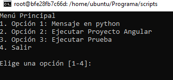
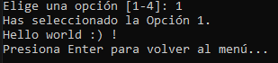
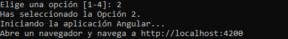
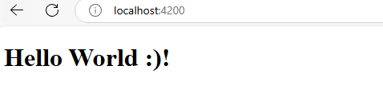
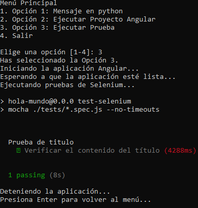

Tutorial Creación De contenedor con Docker 🐳 y Angular con pruebas en Selenium

Prerequisitos: Tener instalado Docker

1. **Descargar la imagen de ubuntu: Se abre la terminal y se ejecuta el siguiente comando**

```shell notranslate position-relative overflow-auto
 docker pull ubuntu
```

2. **Crear un contenedor de Ubuntu: Se crea un contenedor de Ubuntu**

```shell notranslate position-relative overflow-auto
 docker run -it --name ubuntu-container ubuntu
```

3. **Configurar el contenedor de ubuntu: Descargar los paquetes necesarios**

```shell notranslate position-relative overflow-auto
 apt update
 apt upgrade
 apt install nano
 apt install curl
 apt install wget
 apt install gnupg2
 apt install git
 apt install nodejs
 apt install npm
 apt install python-is-python3
 npm install -g @angular/cli
```

4. **Se instala el navegar chrome**

```shell notranslate position-relative overflow-auto
wget -q -O - https://dl.google.com/linux/linux_signing_key.pub | apt-key add -
echo "deb [arch=amd64] https://dl.google.com/linux/chrome/deb/ stable main" | tee -a /etc/apt/sources.list.d/google-chrome.list
apt update
apt install google-chrome-stable
```

5. **Se navega a la siguiente dirección y se crean los elementos necesarios.**

```shell notranslate position-relative overflow-auto
 cd /home/ubuntu
 mkdir Programa
 cd Programa
```

6. **Se crea el archivo de prueba en Python y se abre con nano.**

```shell notranslate position-relative overflow-auto
 touch hello.py
 nano hello.py
```

7. **Se coloca el contenido del archivo:** Se cierra con Ctrl + X.

```shell notranslate position-relative overflow-auto
    print("Hello World :)")
```

8. **Se descarga el proyecto de Angular y se navega a la carpeta:** Tambien se explicara el proceso manual, pero si asi lo prefieres, puedes descargarlo directamente con el siguiente comando.
   **Si realizas este proceso, despues salta al paso 16, ya que a continuacion se explicara el proceso manual**

```shell notranslate position-relative overflow-auto
 git clone https://github.com/RezmaParadox/hola-mundo.git
 cd hola-mundo
 npm install
```

9. **Se crea el proyecto de Angular y se navega a la carpeta.**: En la carpeta Programa se ejecuta el siguiente comando para crear el proyecto de Angular.

```shell notranslate position-relative overflow-auto
   ng new hola-mundo
   cd hola-mundo
```

10. **Se instalan los paquetes del proyecto.**

```shell notranslate position-relative overflow-auto
   npm install --save-dev mocha selenium-webdriver chromedriver
```

11. **Se abre el package.json y se edita el contenido.**

```shell notranslate position-relative overflow-auto
   nano package.json
   
```

Se agrega el script de pruebas en donde sea el apartado de scripts en el package.json.

```shell notranslate position-relative overflow-auto
    "test-selenium": "mocha ./tests/*.spec.js --no-timeouts"
```

12. **Se navega al componente principal y se edita el contenido.**

```shell notranslate position-relative overflow-auto
 cd src/app
 nano app.component.html
```

13. **Se borra el contenido y se coloca lo siguiente:** Se cierra con Ctrl + X.

```shell notranslate position-relative overflow-auto
    <h1>Hello World :)!</h1>
```

14. **Regresamos a la ruta principal del proyecto.**: Se crea la carpeta tests y se crea el archivo **titleTest.spec.js**.

```shell notranslate position-relative overflow-auto
 cd ../../
 mkdir tests
 touch titleTest.spec.js
 nano titleTest.spec.js
```

15. **Se coloca el contenido del archivo:** Se cierra con Ctrl + X.

```shell notranslate position-relative overflow-auto
    const { Builder, By, until } = require('selenium-webdriver');
    const chrome = require('selenium-webdriver/chrome');
    const assert = require('assert');

    describe('Prueba de titulo', function() {
    let driver;

    before(async function() {
        driver = await new Builder()
        .forBrowser('chrome')
        .setChromeOptions(new chrome.Options().addArguments(
            '--headless',  
            '--no-sandbox',
            `--user-data-dir=/tmp/chrome-user-data-${Date.now()}`
        ))
        .build();
    });

    it('Verificar el contenido del título', async function() {
        await driver.get('http://localhost:4200/');
        await driver.wait(until.elementLocated(By.tagName('h1')), 10000);
        let content = await driver.findElement(By.tagName('h1')).getText();
        assert.strictEqual(content, 'Hello World :)!');
    });

    after(async function() {
        if (driver) {
        await driver.quit();
        }
    });
    });
```

* **--headless:** Desactiva la interfaz gráfica del navegador.
* **--no-sandbox:** Desactiva la sandbox del navegador, esto permite ejecutar el navegador sin restricciones.
* **--user-data-dir=/tmp/chrome-user-data-${Date.now()}**: Crea una carpeta temporal para almacenar los datos del navegador.

1.  **Se navega a la carpeta Programa y se crea la carpeta de scripts y se navega a ella.**

```shell notranslate position-relative overflow-auto
 cd ../
 mkdir scripts
 cd scripts
```

17. **Se crea el archivo de menu.sh y se abre con nano.**

```shell notranslate position-relative overflow-auto
 touch menu.sh
 nano menu.sh
```

18. **Se coloca el contenido del archivo:** Se cierra con Ctrl + X.

```shell notranslate position-relative overflow-auto
#!/bin/bash
# --------------------------------------------------
# Script: menu.sh
# Descripción: Un ejemplo de menú interactivo en Bash.
# Uso: ./menu.sh
# --------------------------------------------------

HOME ="~"
EJECUTABLE_PYTHON="/home/ubuntu/Programa"
PROYECTO_ANGULAR="/home/ubuntu/Programa/hola-mundo"

while true; do
    clear
    echo "Menú Principal"
    echo "1. Opción 1: Mensaje en python"
    echo "2. Opción 2: Ejecutar Proyecto Angular"
    echo "3. Opción 3: Ejecutar Prueba"
    echo "4. Salir"
    echo
    read -p "Elige una opción [1-4]: " opcion

    case $opcion in
        1)
            echo "Has seleccionado la Opción 1."

                # Cambia al directorio del archivo
                cd $HOME
                cd $EJECUTABLE_PYTHON
                python hello.py
            read -p "Presiona Enter para volver al menú..."
            ;;

        2)
            echo "Has seleccionado la Opción 2."

                # Cambia al directorio del proyecto
                cd $HOME
                cd $PROYECTO_ANGULAR

                echo "Iniciando la aplicación Angular..."

                echo "Abre un navegador y navega a http://localhost:4200"

                # Inicia la aplicación Angular y es visible en el navegador del usuario
                ng serve --host 0.0.0.0 --disable-host-check


            read -p "Presiona Enter para volver al menú..."
            ;;
        3)
            echo "Has seleccionado la Opción 3."
    

                # Cambia al directorio del proyecto
                cd $HOME
                cd $PROYECTO_ANGULAR


                # Inicia la aplicación en segundo plano usando nohup
                echo "Iniciando la aplicación Angular..."
                nohup ng serve > app.log 2>&1 &

                # Guarda el PID del proceso de ng serve
                APP_PID=$!

                # Espera a que la aplicación esté lista
                echo "Esperando a que la aplicación esté lista..."
                sleep 5

                # Ejecuta las pruebas
                echo "Ejecutando pruebas de Selenium..."
                npm run test-selenium

                # Detén la aplicación
                echo "Deteniendo la aplicación..."
                kill $APP_PID

            read -p "Presiona Enter para volver al menú..."
            ;;

       4)
            echo "Saliendo..."
            exit 0
            ;;
        *)
            echo "Opción inválida, intenta de nuevo."
            read -p "Presiona Enter para continuar..."
            ;;
    esac
done
```

* **EJECUTABLE_PYTHON:** Ruta del archivo Python que deseas ejecutar.
* **PROYECTO_ANGULAR:** Ruta del proyecto de Angular que deseas ejecutar.
* **ng server --host 0.0.0.0 --disable-host-check:** El parámetro --host 0.0.0.0 permite que la aplicación se pueda acceder desde cualquier dirección IP. El parámetro --disable-host-check desactiva la verificación de la dirección IP del host.
* **APP_PID:** Variable que almacena el PID del proceso de ng serve.
* **Kill $APP_PID:** Comando para detener el proceso de ng serve.

19. **Se da permisos al archivo de ejecución.**

```shell notranslate position-relative overflow-auto
 chmod +x menu.sh
```

20. **Antes de ejecutar el script, salimos del bash :** Salimos y creamos un nuevo contenedor pero con la ip 4200, para poder acceder a la app desde nuestro navegador.

```shell notranslate position-relative overflow-auto
 exit
 docker stop ubuntu-container
 docker commit ubuntu-c angular-test
 docker run -it --name angular-test -p 4200:4200 angular-test bash
```

21. **Ejecutamos el script.**

```shell notranslate position-relative overflow-auto
 cd /home/ubuntu/Programa/scripts
 ./menu.sh
```

20. **Resultado:** A continuación se muestran los resultados obtenidos al ejecutar el script.

**Menú Principal**



**Resultado 1**



**Resultado 2**





**Resultado 3**


